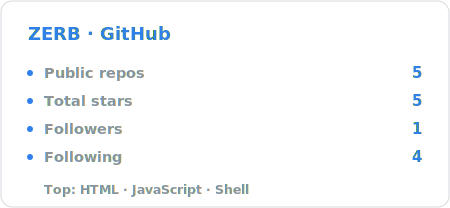

# Hi, I'm Zerb 👋

**Homelabber · self-hosting & AI tinkerer**

*I turn "I wish this existed" into a weekend project — then write down how I did it.*

 

---

### 🧰 What I'm into

- 🏠 **Self-hosting everything** — NAS, Docker, reverse proxies, little services that run 24/7 so my family can use them.
- 🤖 **AI, owned end-to-end** — multi-model gateways, Open WebUI, keeping the keys on my side.
- 🔧 **Tinkering & writing it down** — when I fix a fiddly thing, I document it so the next person (and future me) doesn't bleed for it.

### 🧱 Stack I tinker with

### 📌 Featured

| Project | What it is |
|---|---|
| [**zrxl_blog**](https://github.com/ZerbLion/zrxl_blog) | A zero-build, push-to-publish blog engine — Markdown in, a GitHub Pages site out. |
| [**nas_monitoring**](https://github.com/ZerbLion/nas_monitoring) | Turn an AMD Synology NAS into a clean temperature JSON API for an ESP32 / M5Dial desk dial. |

### ✍️ Latest from the blog

<!-- BLOG:START -->
- **[Build Your Own Multi-Model AI Gateway in a Day: Turn Paid Subscriptions into a Family-Wide Hub](https://zerblion.github.io/zrxl_blog/#/post/2026-06-21-multi-model-ai-gateway)** — From ChatALL pitfalls to rolling my own — a subscription bridge + Open WebUI + NAS, a family-shared, side-by-side multi-model AI hub built in a day. · 2026-06-21
<!-- BLOG:END -->

↑ Auto-updated from <a href="https://zerblion.github.io/zrxl_blog/">zrxl_blog</a> by a GitHub Action.

---

Built in a homelab, documented for the next tinkerer. The long versions live on <a href="https://zerblion.github.io/zrxl_blog/">the blog</a>.

